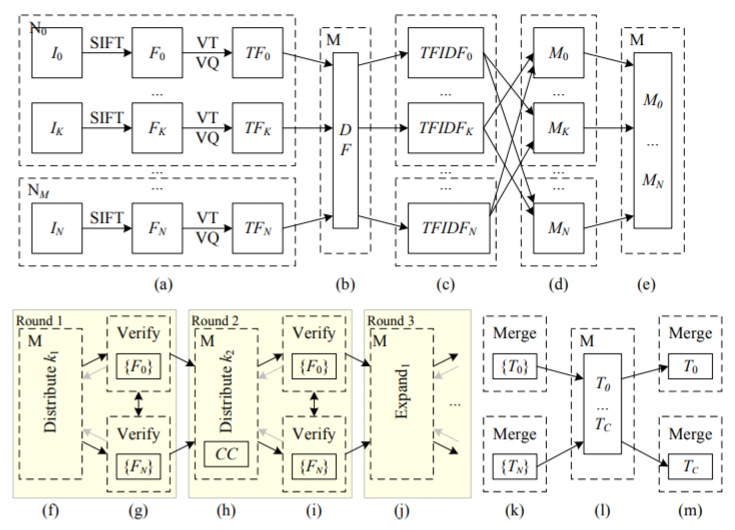

# Project_Vision

- **Building Rome in a Day**(2009)[[PDF](https://grail.cs.washington.edu/rome/rome_paper.pdf)][[Info](https://grail.cs.washington.edu/rome/)]
  - **Session 1**
    - Introduce
      - Search Image from website (flickr.com)
  - **Session 2**
    - PreProcessing and Feature Extraction
      + 유효한 이미지인지 확인한다.
       (Verify that a valid image is valid.)
      + *[EXIF](https://sno.phy.queensu.ca/~phil/exiftool/TagNames/EXIF.html) 태그*를 확인하여 초점길이를 기록한다.
       (Confirm the length of the focal point by checking the *[EXIF](https://sno.phy.queensu.ca/~phil/exiftool/TagNames/EXIF.html) tag*.)
      + 2 Mega-pixels 보다 큰 다운샘플링 이미지를 통해, 종횡비를 유지하고 초점길이를 조정한다.
       (Downsample images larger than 2 Mega-pixels,preserving aspect ratio and scaling focal lengths.)
      + 이미지를 그레이 스케일로 변환하고 [SIFT](http://opencv-python-tutroals.readthedocs.io/en/latest/py_tutorials/py_feature2d/py_sift_intro/py_sift_intro.html) features를 추출한다. [[참고](https://www.robots.ox.ac.uk/~vgg/research/affine/det_eval_files/lowe_ijcv2004.pdf)] (Converted to Grayscale and [SIFT](http://opencv-python-tutroals.readthedocs.io/en/latest/py_tutorials/py_feature2d/py_sift_intro/py_sift_intro.html) features are extracted from here.) [[help](https://www.robots.ox.ac.uk/~vgg/research/affine/det_eval_files/lowe_ijcv2004.pdf)]
      + 속도와 유연한 인터페이스를 위해 Andrea Vedaldi가 만든 SIFT++를 사용 할 것이다. [[참고](http://vision.ucla.edu/)] 
      (Use SIFT++ by Andrea Vedaldi for its speed and flexible interface.) [[help](http://vision.ucla.edu/)]
      + 최종 데이터셋은 이미지와 SIFT features로 분리되어 저장된 1개의 데이터 셋이다. 
      (The final dataset consists of one, separated by images and SIFT features.)
      
    - Matching
    - Geometric Estimation
  - **Session 3**
  - **Session 4**
  - **Session 5**
  
## 참고
- [README 쓰는 방법](https://stackedit.io/editor) (Stack_Edit)
